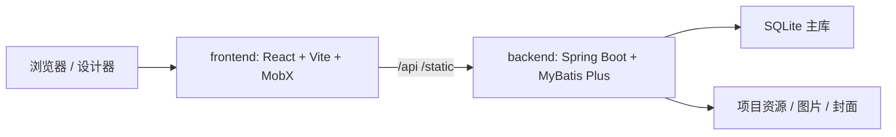

[English](README_EN.md) | 中文

# LIGHT CHASER

LIGHT CHASER 是一套面向大屏展示、数据报表和数据分析场景的开源可视化设计平台。当前仓库已将前端设计器和后端服务合并到同一个代码库，便于统一开发、联调、构建和部署。

<p>
  
  
  
  
  
  
  
</p>

## 项目定位

LIGHT CHASER 不是一个简单的页面拼装器，而是一套可视化设计底座。它把“组件编排、蓝图交互、数据源接入、资源管理、项目导出”放在同一条工作流里，适合快速搭建可交付的数据可视化产品。

## 项目特色

| 特色 | 说明 |
|---|---|
| 前后端同仓 | 前端设计器、后端服务、部署脚本和开发规范统一维护，减少跨仓库协作成本 |
| 拖拽式设计 | 在画布中完成组件摆放、尺寸调整和属性配置，更贴近可视化搭建场景 |
| 蓝图式交互 | 将事件联动、数据流转和节点关系以蓝图方式表达，复杂交互更容易组织 |
| AI 辅助设计 | 提供模型管理页、样式优化和数据优化，效果与桌面端保持一致 |
| 外部数据源接入 | 默认 SQLite 开箱即用，数据源管理页支持连接测试与维护 |
| 资源统一管理 | 项目资源、图片、封面和静态文件统一保存与访问，便于项目资产管理 |
| 可部署性强 | 支持本地开发、Nginx 静态托管、Docker 镜像和 Compose 编排 |

## 技术栈

| 端 | 技术 |
|---|---|
| 前端 | React 18、Vite 5、TypeScript 5、MobX |
| 后端 | Java 17、Spring Boot 3.2.5、MyBatis Plus 3.5.5 |
| 数据库 | SQLite（默认主库） |
| 部署 | Nginx、Docker、Docker Compose |

## 目录结构

| 路径 | 说明 |
|---|---|
| `frontend/` | 前端设计器工程 |
| `backend/` | 后端服务工程 |
| `docs/` | 开发规范、Git 规范等文档 |
| `lc-server.db` | SQLite 数据库文件，启动后生成 |
| `logs/` | 服务运行日志目录 |

## 系统架构



## 核心能力

### 前端设计器

- 画布拖拽、缩放和选择
- 属性面板配置样式、布局和行为
- 蓝图式节点交互编排
- AI 模型管理、AI 样式优化和 AI 数据优化
- 组件库和图表扩展
- 代码编辑器和复杂配置支持
- 首页、模板市场、设计器、预览和结果页形成完整链路

### 后端服务

- 项目创建、复制、更新、导入和导出
- 数据源列表、分页、添加、更新、删除和连接测试
- AI 模型代理接口，供前端调用兼容 OpenAI 的模型服务
- 图片上传、封面管理和静态资源访问
- SQL 执行器和调试接口
- 加密接口支持，便于前后端协同处理敏感请求
- 数据库迁移能力，启动时可自动执行初始化脚本

### 典型工作流

- 创建或导入项目
- 在设计器中拖拽组件并完成页面布局
- 绑定数据源并配置 SQL 或接口数据
- 使用蓝图节点定义事件联动
- 预览、导出并部署到目标环境

## 效果展示


## 文档与入口

- [开发文档](https://xiaopujun.github.io/light-chaser-doc/#/)
- [在线体验](https://xiaopujun.github.io/light-chaser-app/#)
- [部署教程](https://xiaopujun.github.io/light-chaser-doc/#/deploy/deploy_open)
- [部署运维说明](docs/部署运维说明.md)
- [开发规范](docs/开发规范.md)
- [Git 规范](docs/GIT规范.md)

## 推荐版本

如果你正在构建企业级数据可视化平台，或者需要更完整的协作与交付能力，可以优先考虑以下版本。

### LIGHT CHASER Pro（私有化部署）

- 官网入口：https://lcpdesigner.cn/home
- 适用场景：团队协作、权限管理、业务化交付、企业内部系统
- 推荐人群：商业项目、生产环境、需要持续扩展的团队

### LIGHT CHASER Pro 桌面端

- 下载入口：https://lcpdesigner.cn/download
- 适用场景：离线演示、内网环境、轻量部署、单机交付
- 推荐人群：需要开箱即用桌面客户端的个人或团队

## 快速开始

### 环境要求

- Node.js
- pnpm
- Java 17+
- Maven 3.6+

### 1. 启动后端

建议先启动后端，再启动前端。

```bash
cd backend
mvn spring-boot:run
```

后端默认监听 `http://localhost:8080`。SQLite 数据库默认使用 `jdbc:sqlite:${user.dir}/lc-server.db`，数据库文件会生成在当前启动目录中。

### 2. 启动前端

```bash
cd frontend
pnpm install
pnpm dev
```

前端默认访问 `http://localhost:5173`。开发模式下，`/api` 和 `/static` 请求会代理到 `http://127.0.0.1:8080`，因此需要后端同时启动。

### 3. 常用命令

前端：

```bash
pnpm build
pnpm lint
pnpm preview
pnpm check
```

后端：

```bash
mvn clean compile
mvn test
mvn clean package
```

## 配置说明

### 后端

- 配置文件：`backend/src/main/resources/application.yml`
- `spring.datasource.url` 默认指向 `jdbc:sqlite:${user.dir}/lc-server.db`
- `light-chaser.project-resource-path` 未配置时默认取启动目录 `user.dir`，建议指向一个可持久化且可写的目录
- 图片资源默认映射到 `/static/images`
- 封面资源默认映射到 `/static/covers`
- `light-chaser.ai.enabled` 控制 AI 功能是否启用
- `light-chaser.ai.models` 用于配置可调用模型列表，默认支持通过 `LC_AI_MODEL`、`LC_AI_BASE_URL` 和 `LC_AI_API_KEY` 环境变量覆盖
- `light-chaser.crypto.rsa.public-key-path` 和 `light-chaser.crypto.rsa.private-key-path` 默认位于 `light-chaser.project-resource-path/keys/`，如果文件不存在，启动时会自动生成并持久化
- RSA 和 AES 相关配置已内置在 `light-chaser.crypto`

### 前端

- 开发代理配置：`frontend/vite.dev.config.ts`
- 生产 Nginx 配置：`frontend/nginx.conf`
- 构建产物由 `frontend/Dockerfile` 中的 Nginx 镜像托管

## 接口速览

| 模块 | 说明 |
|---|---|
| `/api/project` | 项目创建、更新、复制、导入、导出和详情获取 |
| `/api/commonDatabase` | 数据源管理和连接测试 |
| `/api/aiModel` | AI 模型管理、列表与调用 |
| `/api/image` | 图片上传、分页和删除 |
| `/api/db/executor` | SQL 执行 |
| `/api/crypto` | 加密相关能力 |
| `/api/debug` | 调试接口 |

## 部署说明

- 推荐的同源部署方式是执行 `node scripts/deploy-same-origin.js`。脚本会先构建前端，再把 `frontend/dist` 合并到 `backend/src/main/resources/static`，最后重新打包后端，并额外生成 `backend/target/lc-server-release.zip`。这个压缩包内同时包含 `lc-server.jar` 和 `docs/部署运维说明.md`，适合直接交付给运维或部署人员。
- 启动成功后，直接访问 `http://localhost:8080/`；如果是远程服务器，把 `localhost` 换成服务器 IP 或域名即可。
- 如果你只是想检查流程，可以先加上 `--dry-run` 预览将执行的步骤。
- 如果本机默认 Java 版本低于 17，可以通过 `--java-home /path/to/jdk17` 指定后端构建所使用的 JDK。
- 更详细的启停、配置、日志、升级和回滚说明，请直接查看 `docs/部署运维说明.md`。
- 如果你仍然需要拆分部署，前端可先执行 `pnpm build`，再使用 `frontend/Dockerfile` 或现有 Nginx 配置部署 `frontend/dist`
- 后端可先执行 `mvn clean package`，产物默认是 `backend/target/lc-server.jar`；`backend/Dockerfile` 已改为直接引用这个固定名称
- `backend/docker-compose.yml` 仍保留为拆分部署示例，镜像标签和挂载路径可按实际环境调整
- AI 功能提供模型管理页、样式优化和数据优化；其中数据优化仅支持开源版已有的数据源类型：`static`、`api`、`database`

## 贡献与支持

- 欢迎提交 Issue 或 PR
- 更细的开发规范和 Git 规范请参考 `docs/` 目录
- 如果你在部署或二次开发中遇到问题，可以先对照文档与源码确认实际配置项

## 许可证与商用

- 本项目遵循 Apache 2.0 协议，请保留作品声明
- 本项目仅用于学习交流，商业用途请务必先获取授权

## 联系作者

如需反馈问题、沟通合作，或了解项目最新进展，可以通过下方方式联系作者。

<div style="display: flex; flex-wrap: wrap; gap: 16px; align-items: flex-start">
    <div style="width: 100%; max-width: 420px">
        
    </div>
</div>

## 社区 & 可持续发展

如果你对 LIGHT CHASER 项目感兴趣，欢迎加入社区群聊交流使用经验、反馈问题，也欢迎通过 Issue 或 PR 参与项目改进。你的每一次反馈，都会帮助我们把这个项目做得更好。

<div style="display: flex; flex-wrap: wrap; gap: 16px; align-items: flex-start">
    <div style="width: 100%; max-width: 360px">
        
    </div>
</div>

LIGHT CHASER 已推出 Pro 版本。如果你有捐赠意愿，或希望洽谈商业合作，欢迎赞助我。作为感谢，我会向支持者提供 LIGHT CHASER Pro 版本。

你现在可以通过 [http://www.lcdesigner.cn/](http://www.lcdesigner.cn/) 快速体验 Pro 的全部功能。

- 账号：`admin`
- 密码：`123456`

感谢每一位项目贡献者、捐赠者和赞助商。

## 友情链接

:+1: **enjoy-iot 物联网平台**([https://gitee.com/open-enjoy/enjoy-iot](https://gitee.com/open-enjoy/enjoy-iot))
