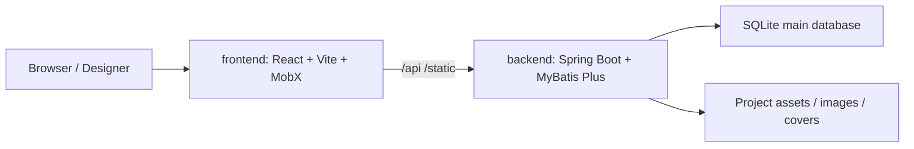

[中文](README.md) | English

# LIGHT CHASER

LIGHT CHASER is an open-source visual design platform for large-screen dashboards, data reports, and data analysis scenarios. This repository combines the frontend designer and backend service into a single codebase for easier development, integration, builds, and deployment.

<p>
  
  
  
  
  
  
  
</p>

## Positioning

LIGHT CHASER is more than a page builder. It is a visual design foundation that brings component composition, blueprint-based interactions, data source integration, asset management, and project export into one workflow. It is designed for quickly building deliverable data visualization products.

## Highlights

| Feature | Description |
|---|---|
| Monorepo workflow | Frontend designer, backend service, deployment scripts, and development docs live in one repository |
| Drag-and-drop design | Arrange components, resize elements, and configure properties directly on the canvas |
| Blueprint interactions | Model event linking, data flow, and node relationships in a visual blueprint editor |
| AI-assisted design | Model management, style optimization, and data optimization that match the desktop experience |
| External data source access | SQLite works out of the box, and the data-source management page supports connection testing and maintenance |
| Unified asset management | Project resources, images, covers, and static files are stored and served consistently |
| Deployment-friendly | Supports local development, Nginx hosting, Docker images, and Compose-based orchestration |

## Tech Stack

| Layer | Technologies |
|---|---|
| Frontend | React 18, Vite 5, TypeScript 5, MobX |
| Backend | Java 17, Spring Boot 3.2.5, MyBatis Plus 3.5.5 |
| Database | SQLite (default main database) |
| Deployment | Nginx, Docker, Docker Compose |

## Repository Layout

| Path | Description |
|---|---|
| `frontend/` | Frontend designer project |
| `backend/` | Backend service project |
| `docs/` | Development guidelines, Git guidelines, and related documents |
| `lc-server.db` | SQLite database file generated after startup |
| `logs/` | Service log directory |

## System Architecture



## Core Capabilities

### Frontend Designer

- Canvas drag, zoom, and selection
- Property panels for style, layout, and behavior
- Blueprint-based node interaction orchestration
- AI model management, AI style optimization, and AI data optimization
- Component library and chart extensions
- Code editor support for advanced configuration
- End-to-end flow from home page to template market, designer, preview, and result views

### Backend Service

- Project creation, duplication, update, import, and export
- Data source listing, pagination, add, update, delete, and connection testing
- AI model proxy APIs for calling OpenAI-compatible model services from the frontend
- Image upload, cover management, and static resource serving
- SQL execution and debugging APIs
- Encryption-related APIs for secure frontend-backend coordination
- Database migration support with automatic initialization on startup

### Typical Workflow

- Create or import a project
- Drag components onto the canvas and build the layout
- Bind data sources and configure SQL or API data
- Define event interactions through the blueprint editor
- Preview, export, and deploy to the target environment

## Screenshots


## Documentation & Links

- [Developer Docs](https://xiaopujun.github.io/light-chaser-doc/#/)
- [Online Demo](https://xiaopujun.github.io/light-chaser-app/#)
- [Deployment Guide](https://xiaopujun.github.io/light-chaser-doc/#/deploy/deploy_open)
- [Deployment & Ops Guide](docs/部署运维说明.md)
- [Development Guidelines](docs/开发规范.md)
- [Git Guidelines](docs/GIT规范.md)

## Recommended Editions

If you are building an enterprise-grade data visualization platform or need stronger collaboration and delivery capabilities, consider the following editions first.

### LIGHT CHASER Pro (Private Deployment)

- Official site: https://lcpdesigner.cn/home
- Best for: team collaboration, permission management, business delivery, internal enterprise systems
- Recommended for: commercial projects, production environments, and teams that need continuous expansion

### LIGHT CHASER Pro Desktop

- Download: https://lcpdesigner.cn/download
- Best for: offline demos, intranet environments, lightweight deployment, single-machine delivery
- Recommended for: individuals or teams that want an out-of-the-box desktop client

## Quick Start

### Requirements

- Node.js
- pnpm
- Java 17+
- Maven 3.6+

### 1. Start the Backend

Start the backend first, then start the frontend.

```bash
cd backend
mvn spring-boot:run
```

The backend listens on `http://localhost:8080` by default. The SQLite database uses `jdbc:sqlite:${user.dir}/lc-server.db`, and the database file is created in the current working directory.

### 2. Start the Frontend

```bash
cd frontend
pnpm install
pnpm dev
```

The frontend runs at `http://localhost:5173` by default. In development mode, `/api` and `/static` requests are proxied to `http://127.0.0.1:8080`, so the backend must be running as well.

### 3. Common Commands

Frontend:

```bash
pnpm build
pnpm lint
pnpm preview
pnpm check
```

Backend:

```bash
mvn clean compile
mvn test
mvn clean package
```

## Configuration Notes

### Backend

- Config file: `backend/src/main/resources/application.yml`
- `spring.datasource.url` defaults to `jdbc:sqlite:${user.dir}/lc-server.db`
- `light-chaser.project-resource-path` defaults to the startup directory `user.dir` if not configured
- Images are served from `/static/images`
- Covers are served from `/static/covers`
- `light-chaser.ai.enabled` toggles the AI features
- `light-chaser.ai.models` defines the available model list, and the default values can be overridden by `LC_AI_MODEL`, `LC_AI_BASE_URL`, and `LC_AI_API_KEY`
- RSA and AES settings are built into `light-chaser.crypto`

### Frontend

- Development proxy config: `frontend/vite.dev.config.ts`
- Production Nginx config: `frontend/nginx.conf`
- Build artifacts are served by the Nginx image in `frontend/Dockerfile`

## API Overview

| Module | Description |
|---|---|
| `/api/project` | Project creation, update, duplication, import, export, and detail retrieval |
| `/api/commonDatabase` | Data source management and connection testing |
| `/api/aiModel` | AI model management, listing, and execution |
| `/api/image` | Image upload, pagination, and deletion |
| `/api/db/executor` | SQL execution |
| `/api/crypto` | Encryption-related capabilities |
| `/api/debug` | Debug endpoints |

## Deployment

- The recommended same-origin deployment flow is `node scripts/deploy-same-origin.js`. The script builds the frontend, copies `frontend/dist` into `backend/src/main/resources/static`, repackages the backend, and also generates `backend/target/lc-server-release.zip`. The release zip contains both `lc-server.jar` and `docs/部署运维说明.md`, so it can be handed directly to operations or deployment teams.
- After startup, open `http://localhost:8080/`; for a remote server, replace `localhost` with the server IP or domain.
- If you only want to preview the workflow, add `--dry-run` first.
- If your default Java version is below 17, pass `--java-home /path/to/jdk17` to point the backend build to a JDK 17 installation.
- For the full startup, configuration, logging, upgrade, and rollback procedure, see `docs/部署运维说明.md`.
- If you still need split deployment, build the frontend with `pnpm build` and deploy `frontend/dist` using `frontend/Dockerfile` or your own Nginx setup
- Build the backend with `mvn clean package`; the default artifact is `backend/target/lc-server.jar`, and the backend Dockerfile references that fixed name directly
- `backend/docker-compose.yml` remains as a split-deployment example, and you can adjust image tags and mount paths for your environment
- AI features currently provide model management, style optimization, and data optimization. Data optimization is limited to the open-source data source types already supported by the repository: `static`, `api`, and `database`

## Contributing & Support

- Issues and pull requests are welcome
- For more detailed guidance, see the documents in `docs/`
- If you run into deployment or customization issues, check the source code and configuration first

## License & Commercial Use

- This project is licensed under Apache 2.0. Please keep the copyright notice
- This project is provided for learning and communication only. Please obtain authorization before using it commercially

## Contact Author

If you want to report issues, discuss collaboration, or follow the latest project progress, feel free to reach out through the contact channel below.

<div style="display: flex; flex-wrap: wrap; gap: 16px; align-items: flex-start">
    <div style="width: 100%; max-width: 420px">
        
    </div>
</div>

## Community & Sustainability

If you are interested in the LIGHT CHASER project, you are welcome to join the community chat to share usage experience, report issues, and contribute via Issues or Pull Requests. Every bit of feedback helps us improve the project.

<div style="display: flex; flex-wrap: wrap; gap: 16px; align-items: flex-start">
    <div style="width: 100%; max-width: 360px">
        
    </div>
</div>

LIGHT CHASER now offers a Pro version. If you would like to support the project through donations or explore commercial cooperation, sponsorship is welcome. As a thank-you, I will provide the LIGHT CHASER Pro version to supporters.

You can try the full Pro experience at [http://www.lcdesigner.cn/](http://www.lcdesigner.cn/).

- Account: `admin`
- Password: `123456`

Thanks to every contributor, donor, and sponsor of the project.
