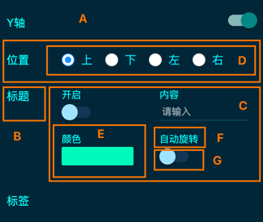

lc项目规范化开发文档及标准制定

# 一、前言

# 二、约定规范

## 2.1 文件目录

## 2.2 文件命名

## 2.3 react组件参数

## 2.4 class类名（css)

### 2.4.1 lc设计器右侧配置项

|class名|说明|对应|
|---|---|---|
|lc-cfg-item|设置项|A|
|lc-cfg-title|设置项标题|B|
|lc-cfg-content-row|设置项内容|C|
|lc-cfg-content-block|设置项内容|C|
|lc-cfg-block|块设置项容器|E|
|lc-cfg-block-title|块设置项标题|F|
|lc-cfg-block-content|块设置项内容|G|
